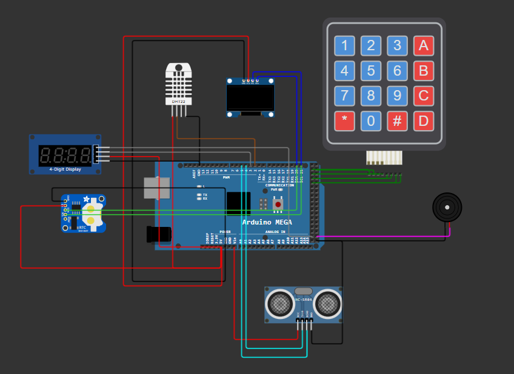

# Arduino Multi-Feature Project

This project integrates several hardware components to demonstrate a multi-functional system using an Arduino board. The features include displaying information on an OLED screen, interacting via a keypad, showing time on a 7-segment display, and monitoring environmental conditions with a DHT sensor.

## image

## Features

- **OLED Display**: Displays animations, menus, and system information.
- **7-Segment Display (TM1637)**: Shows real-time clock and other numeric data.
- **Keypad Input**: Accepts user input for navigating menus and entering passwords.
- **DHT Sensor**: Measures temperature and humidity.
- **Real-Time Clock (RTC)**: Maintains accurate time.
- **Password Protection**: Secures access to the system.
- **Menu System**: Allows users to navigate between features like distance measurement, temperature display, and more.

## Components Used

- **Arduino Board**: Compatible with Arduino Mega and similar boards.
- **OLED Display (SSD1306)**: 128x64 pixels.
- **TM1637 7-Segment Display**: For numeric output.
- **Keypad**: Matrix keypad for user interaction.
- **DHT Sensor**: Measures temperature and humidity.
- **RTC Module**: Provides real-time clock functionality.

## Libraries Required

Ensure you have the following libraries installed in your Arduino IDE:

- [Adafruit GFX Library](https://github.com/adafruit/Adafruit-GFX-Library)
- [Adafruit SSD1306 Library](https://github.com/adafruit/Adafruit_SSD1306)
- [TM1637 Library](https://github.com/avishorp/TM1637)
- [Keypad Library](https://github.com/Chris--A/Keypad)
- [RTClib](https://github.com/adafruit/RTClib)
- [DHT Library](https://github.com/adafruit/DHT-sensor-library)

## Hardware Connections

### OLED Display (SSD1306)
- **VCC**: 3.3V
- **GND**: GND
- **SCL**: A5 (or corresponding pin for your board)
- **SDA**: A4 (or corresponding pin for your board)

### 7-Segment Display (TM1637)
- **CLK**: Pin 52
- **DIO**: Pin 3

### Keypad
- Connect to digital pins as per your keypad layout.

### DHT Sensor
- **Data**: Pin 6
- **VCC**: 5V
- **GND**: GND

### RTC Module
- **SCL**: A5 (or corresponding pin for your board)
- **SDA**: A4 (or corresponding pin for your board)

## Setup Instructions

1. Clone or download the project code.
2. Open the `.ino` file in Arduino IDE.
3. Install the required libraries via the Arduino Library Manager or manually.
4. Connect the hardware components as per the instructions.
5. Compile and upload the code to your Arduino board.

## Usage

1. Upon startup, the OLED displays an animation and a password prompt.
2. Use the keypad to enter the password and access the main menu.
3. Navigate through features such as:
   - **Temperature & Humidity Monitoring**
   - **Distance Measurement**
   - **Clock Settings**
   - **Calculator**
   - **Simple Game**
   - **Device Lock/Unlock**
4. Interact with the system using the keypad and view outputs on the OLED and 7-segment displays.

## Code Overview

- **Initialization**: Includes setting up peripherals and initializing libraries.
- **Menu System**: Structured to navigate between features.
- **Sensor Handling**: Reads data from the DHT sensor and RTC module.
- **Display Updates**: Outputs information dynamically to the OLED and TM1637 displays.
- **default password**: "1234"

in wokwi site: [click here](https://wokwi.com/projects/419418332252822529).